=========================
User and Programmer Guide
=========================

------------
Introduction
------------

This page contains the User and Programmer guide of the reference implementation of the Revenue Settlement and Sharing Sytem GE.

----------
User Guide
----------

The RSS is a software which provides pure backend functionality to other applications (e.g. Generic Enablers or end user facing applications). However, a web interface is offered in order to allow RSS and store administrators interact with the back-end functionality. This section covers the functionality of the administration interface.

The administration interface only can be accesed by those users that have been regsitered as administrators of the RSS in the FIWARE Identity Manager (Using roles). Aditionally, administrators of the stores already registered can also access this interface. In this case, they will be only allowed to view and use it limited to the scope of the assets that belongs to their store.

Register Store
==============

The administration interface allows to register new stores, which are charging information sources. To do that, it is required to include the email of the user of the FIWARE identity manager who admins the concrete store instance, and a display name for the store.

Once a Store is registered, it is possible to send charging information to the RSS in order to perform the revenue sharing of its providers.

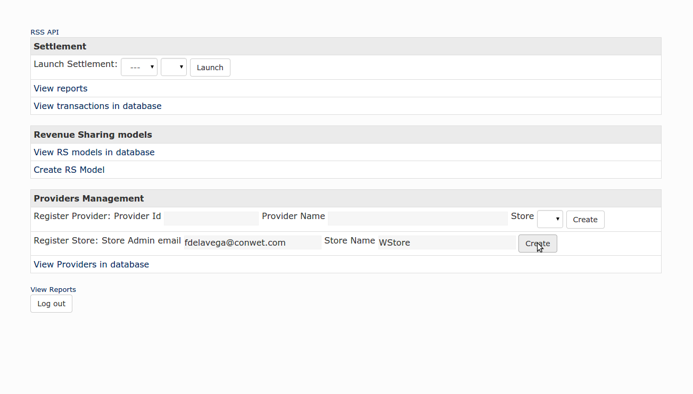

.. note::
    Store administrators cannot perform this action

Register Provider
=================

Additionally, it is possible to use the administration interface to register providers of a given store. To do that, it is necessary to provide an id, a display name, and select a store. 

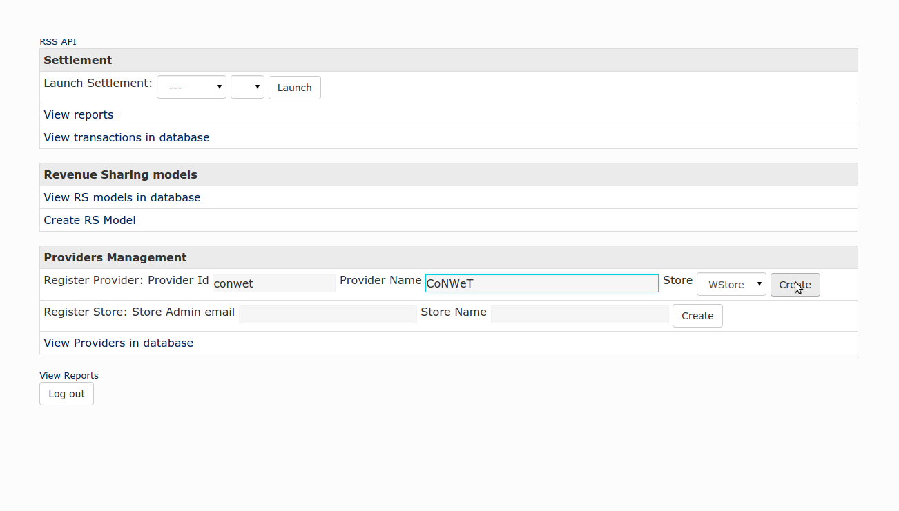

.. note::
  Store administrators only can register providers of the store they are owning

View Providers
==============

It is possible to view the providers already registered in the RSS using the administration interface. To view existing providers click on *View Providers in database*.

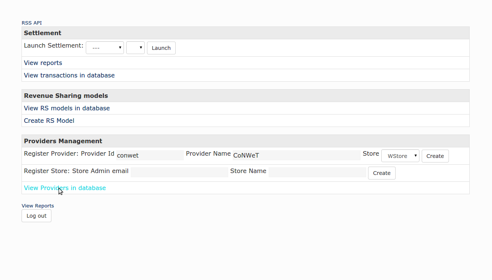

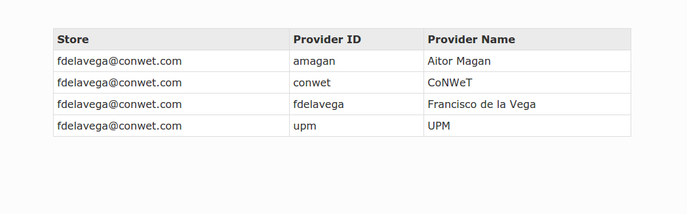

.. note::
  Store administrators only can view providers of the store they are owning

Create Revenue Sharing Model
============================

Revenue Sharing Models in the RSS specify how the revenues generated by a set of offerings must be distributed. In this regard, the administration interface allows to create revenue sharing models by clicking on *Create RS Model*.

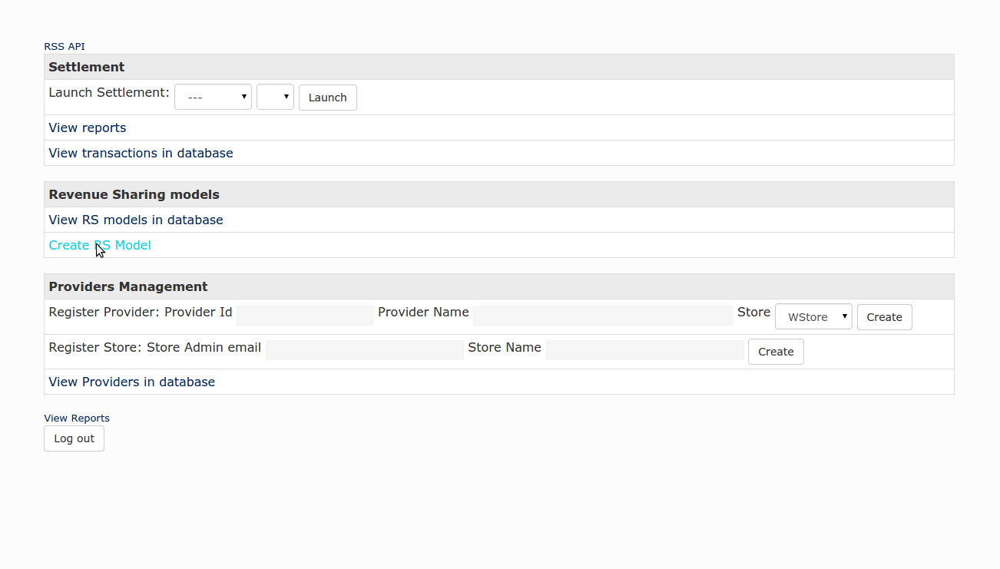

The first step for creating a RS model is selecting the Store where the charging information is being generated, and specify the percentage of the revenue that belongs to their owners (*Store Value*). Then, it is necessary to specify the provider, who owns the offering or group of offerings whose revenues are going to be distrubuted using the current model, and provide the percentage of the revenue that belongs to her (*Provider Value*).

Next, it is required to fill the *Product Class*. This value is used as the identifier of the RS model and identifies an offering or group of offerings.

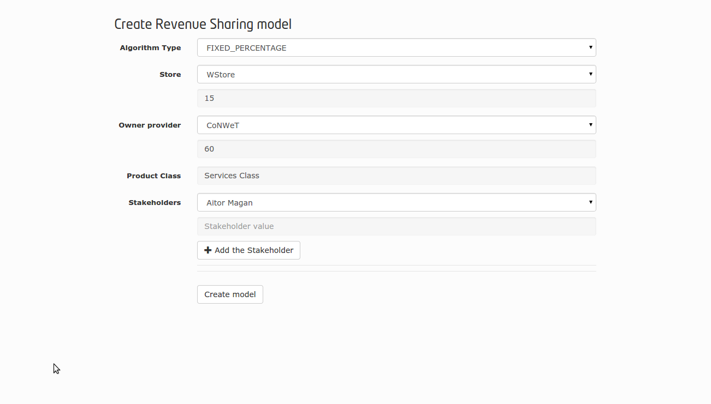

There are some offerings, that are composed of services belonging to different providers. To deal with that, it is possible to specify additional stakeholders to the revenue sharing model including their percentage of the revenues.

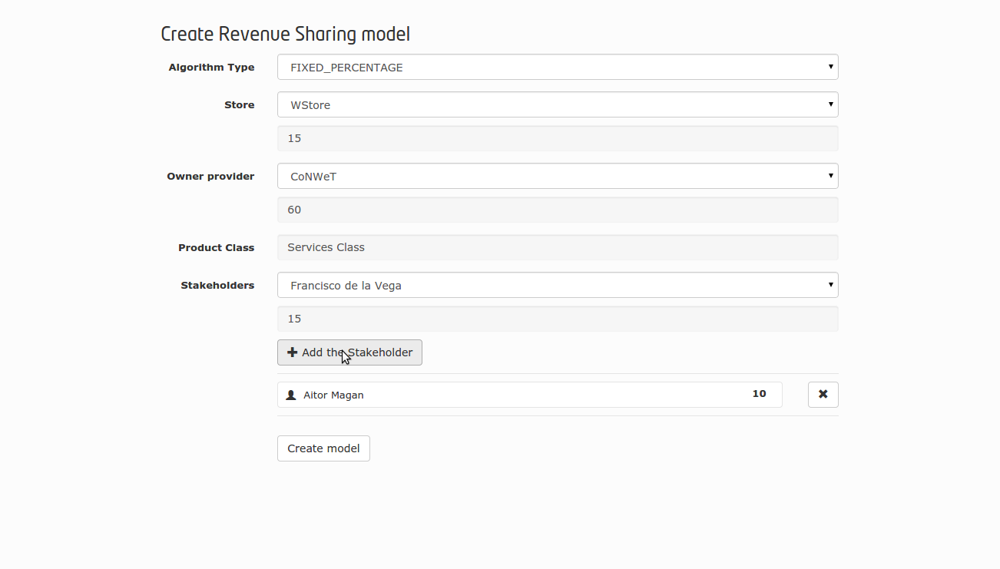

Finally, the model is created by clicking on *Create Model*

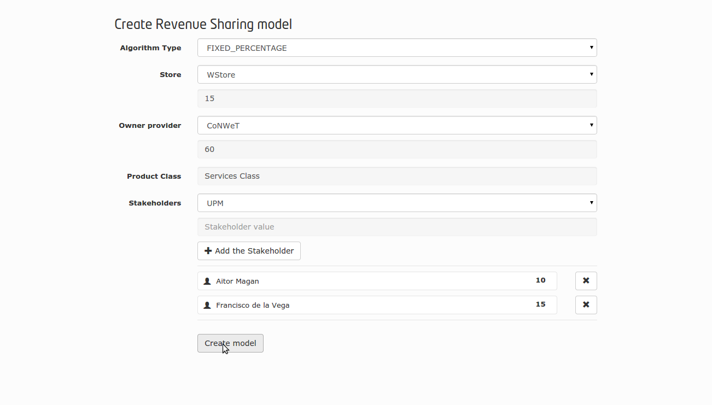

.. note::
  Store administrators only can create RS models for the providers of the store they are owning

View Revenue Sharing Models
===========================

The administration interface allows to view existing RS models by clicking on *View RS models in database*.

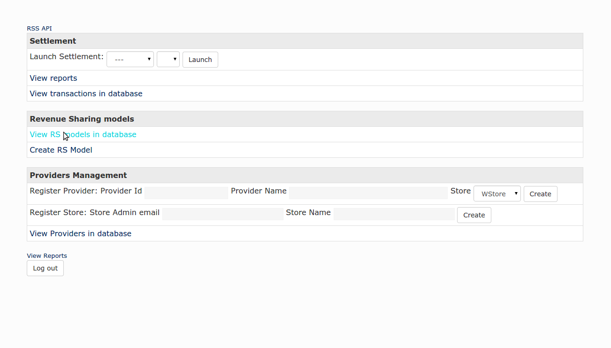

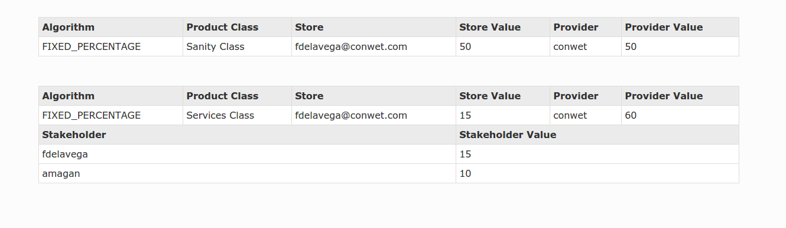

.. note::
  Store administrators only can view RS models of the store they are owning

View Transactions
=================

As stated, the RSS provides pure backend functionality. In this respect, the different transactions with charging information generated in the stores are fed to the RSS via API. Nevertheless, the administration interface allows to view the existing (not aggregated) transactions. To do that, click on *View transactions in database*.

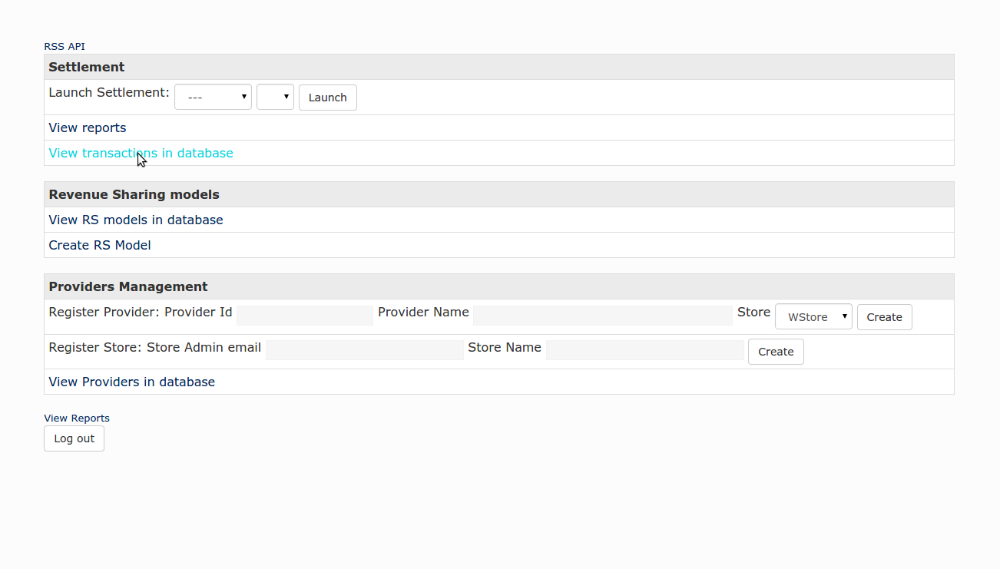

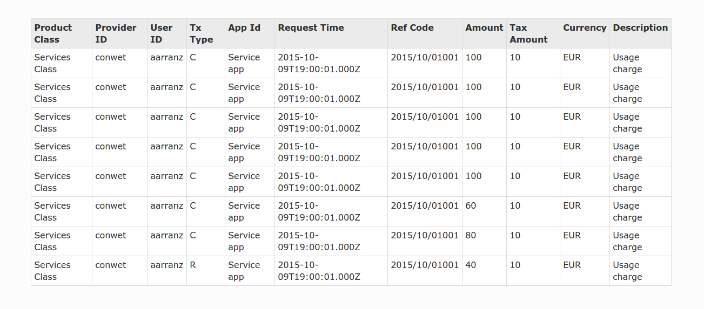

Launch Settlement
=================

Transactions stored in the RSS contain charging information that is used to calculate the revenue sharing using the corresponding RS model. In this regard, the administration interface allows to launch the process that aggregates charging info and calculates the revenue sharing (The Settlement process).

The interface allows to launch the settlement for all the pending transactions, for the all the pending transactions generated in a store, or for all the pending transactions belonging to a concrete provider.

This can be done in the settlement section by selecting the store, the provider, and clicking *Launch*

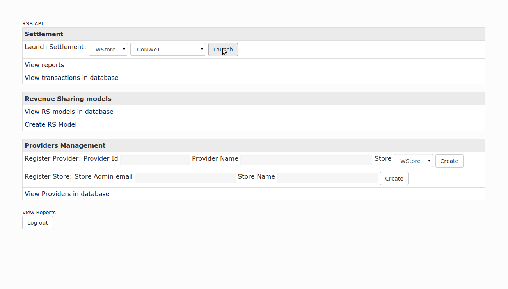

.. note::
  Store administrators only can launch the process for their store or its providers.

View Revenue Sharing Reports
============================

The settlement process generates a set of reports that specify how revenues must be distributed. This reports can be viewed in the admin interface by clicking on *View reports*.

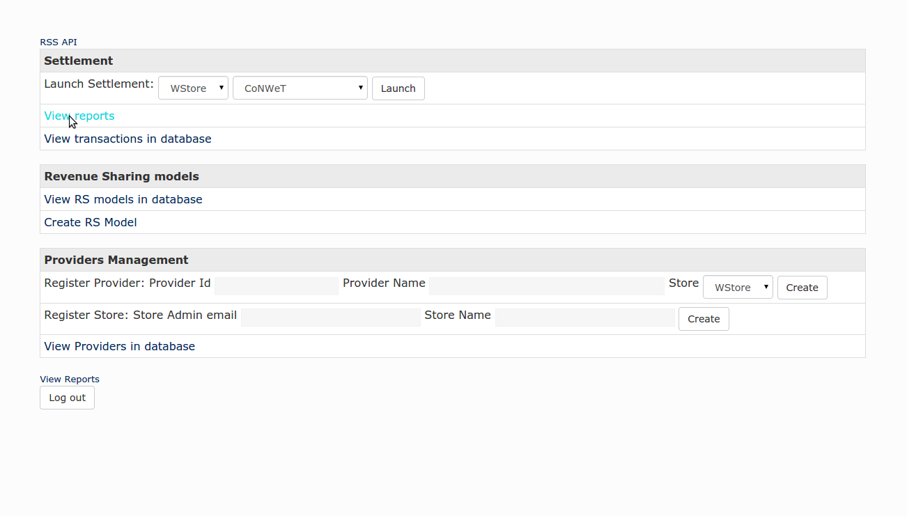

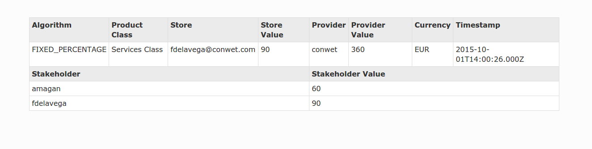

----------------
Programmer Guide
----------------

The RSS offers its functionality as a REST API that can be used by developers to integrate revenue sharing functionality with their own solutions. This section covers the main aspects of the RSS API and the actions that can be performed with it.

This section is not a detailed reference of the RSS API. You can find this documentation in:

* `Apiary <http://docs.fiwarerss.apiary.io>`__
* `GitHub pages <http://conwetlab.github.io/fiware-rss/>`__

It is important to remark that the RSS is integrated with the FIWARE Identity Manager for authenticating and authorizing users. In this regard, all the requests made to the RSS API must include an `Authorization` header containing a valid OAuth2 token.

Stores and Providers Management
===============================

The first step for a developer to integrate the RSS APIs is integrating the aggregator (Store admin) and provider APIs. These APIs are available at:

* Aggregator: ``/fiware-rss/rss/aggregators``
* Provider: ``/fiware-rss/rss/providers``

Both resources support ``POST`` and ``GET`` operations for creating an retrieving entities using JSON.

Following you can find the JSON serialization of an aggregator. ::

  {
      "aggregatorName": "WStore",
      "aggregatorId": "fdelavega@conwet.com"
  }

The aggregator model contains the following fields:

*  **aggregatorName** - Display name of the given aggregator
*  **aggragtorId** - Email used to identify the user that is authorized to send changing information (typically an admin of a Store instance)

Following you can find the JSON serialization of a provider. ::

  {
      "aggregatorId": "fdelavega@conwet.com",
      "providerId": "conwet",
      "providerName": "CoNWeT"
  }

The provider model contain the following fields:

*  **aggregatorId** - Aggregator email that identifies the charging information source (Store instance)
*  **providerId** - Id of the given provider. Note that this id only needs to be unique in the context of an aggregator, so the same providerId can be used for different providers if the aggregator is different
*  **providerName** - Display name of the given provider

Revenue Sharing Models Management
=================================

To be able to calculate the revenue sharing, it is required to have revenue sharing models. RS models are managed in the RSS API using the resource:

* ``/fiware-rss/rss/models``

These models can be created using a ``POST`` request, and retrieved with a ``GET`` request with JSON content type. Following you can find the JSON serialization of a revenue sharing model. ::

  {
      "ownerProviderId": "fdelavega",
      "ownerValue": 60,
      "productClass": "orionServices",
      "algorithmType": "FIXED_PERCENTAGE",
      "aggregatorId": "fdelavega@conwet.com",
      "aggregatorValue": 20,
      "stakeholders": [
          {
              "stakeholderId": "aarranz",
              "modelValue": 20
          }
      ]
  }    

These models manage the following fields:

*  **ownerProviderId** - Provider Id of the owner of the model. This provider is the owner of the application and services whose revenues will be distributed using the Revenue Sharing Model
*  **ownerValue** - Value of the owner provider in the Revenue Sharing Model. The semantics of this field depends on the algorithm specified, for example if the algorithm is a fixed precentage, this field will contain the percetage of the revenue that belongs to the owner provider.
*  **productClass** - Id of the Revenue Sharing Model. This field represents a group of services or applications whose revenues are distributed in the same way
*  **algorithmType** - ID of the algorithm that is used in this model
*  **aggregatorId** - Id of the aggregator that represents the Store instance where the applications and services are offered, and thus, must receive part of the revenues
*  **aggregatorValue** - Value of the aggregator in the Revenue Sharing Model
*  **stakeholders** - List of providers that are stakeholders of the applications and services included in a given product class, and thus, must receive part of the revenues. For each stakeholder the following fields are included:
    * **stakeholderId** - provider Id of the Stakeholder
    * **modelValue** - Value of the stakeholder in the Revenue Sharing Model

Transactions Management
=======================

Once the RSS has RS models, it is needed to receive charging information. The different transactions that contain the charging information are managed in the RSS using CDR (Charging Detailed Records) documents. CDRs are managed in the RSS using the resource:

* ``/fiware-rss/rss/cdrs``

These CDRs are created using a ``POST`` request and retrieved using a ``GET`` request with JSON content type. Following, you can find the JSON serialization of a CDR. ::

  {
      "cdrSource": "fdelavega@conwet.com",
      "productClass": "orionServices",
      "correlationNumber": 112,
      "timestamp": "2015-07-15T19:00:01.000Z",
      "application": "OrionStarterKit",
      "transactionType": "C",
      "event": "use",
      "referenceCode": "555b079d8e05ac213ff15827",
      "description": "Usage of OrionStarterKit Offering",
      "chargedAmount": 10,
      "chargedTaxAmount": 3,
      "currency": "EUR",
      "customerId": "amagan",
      "appProvider": "fdelavega"
  }

CDRs contain the following fields:

*  **cdrSource** - Id of the aggregator that represent the Store instance that is generating the charging information
*  **productClass** - Product Class used to identify the revenue sharing model that will be used to distribute the revenues generated in the current transaction
*  **correlationNumber** - Correlation number of the transaction
*  **timestamp** - Timestamp of the transaction
*  **application** - Textual field with the id of the application or service that generates the transaction
*  **transactionType** - Type of transaction. This field can contain "C" for charges and "R" for refunds
*  **event** - Textual field that describes the event that generated the transaction (e.g pay-per-use)
*  **referenceCode** - Reference code that identifies the purchase in the Store instance that generates the transaction
*  **description** - Textual description of the transaction
*  **chargedAmount** - Part of the total charged amount to be distributed. The total amount charged to the customer includes also the field chargedTaxAmount
*  **chargedTaxAmount** - Part of the total charged amount that are taxes. The total amount charged to the customer includes also the field chargedAmount
*  **currency** - Currency of the transaction
*  **customerId** - Id of the customer that acquires the given service or application
*  **appProvider** - provider Id of the owner of the charged applications or services

Settlement Management
=====================

If some transactions have been received and there are RS models able to manage them, then, it is possible to launch the settlement process. The settlement process is launched using the resource:

* ``/fiware-rss/rss/settlement``

To launch the process is needed to make a ``GET`` request using query strings to filter the scope:

* None: if no query string is provided the settlement process is launched for all the pending transactions.
* aggregatorId: Id of a given aggregator. If this query string is provided the settlement process is launched  only for those pending transactions generated in the given store.
* providerId: Id of a given provider. If this query string is provided the settlement process is launched  only for those pending transactions generated in the given store, and belonging to the given provider.
* productClass: Product class of the RS models.  If this query string is provided the settlement process is launched  only for those pending transactions generated in the given store, belonging to the given provider, and with the given product class.

The result of the settlement process are a couple of reports that specify the concrete amount that has to paid to the concrete stakeholders involved. The reports can be accesed using the resource:

* ``/fiware-rss/rss/settlement/reports``

RS Reports can be retrieved using a ``GET`` request. Following you can find a report serialized in JSON format. ::

  {
      "ownerProviderId": "fdelavega",
      "ownerValue": 4578,
      "productClass": "orionServices",
      "algorithmType": "FIXED_PERCENTAGE",
      "aggregatorId": "fdelavega@conwet.com",
      "aggregatorValue": 3000,
      "currency": EUR,
      "timestamp": "2015-07-15T19:00:01"
      "stakeholders": [
          {
              "stakeholderId": "aarranz",
              "modelValue": 2500
          }
      ]
  }    

These reports contain the following fields:

*  **ownerProviderId** - Provider Id of the owner of the model. This provider is the owner of the application and services whose revenues has been aggregated.
*  **ownerValue** - Amount that has to be paid to the provider.
*  **productClass** - Id of the Revenue Sharing Model that have been applied. This field represents a group of services or applications whose revenues are distributed in the same way
*  **algorithmType** - ID of the algorithm that have been used.
*  **aggregatorId** - Id of the aggregator that represents the Store instance where the applications and services are offered, and thus, must receive part of the revenues
*  **aggregatorValue** - Amount that has to be paid to the store owners.
*  **currency**: Currency of the different amounts.
*  **timestamp**: Timestamp of the reports.
*  **stakeholders** - List of providers that are stakeholders of the applications and services included in a given product class, and thus, must receive part of the revenues. For each stakeholder the following fields are included:
    * **stakeholderId** - provider Id of the Stakeholder
    * **modelValue** - Amount that has to be paid to the concrete stakeholder

